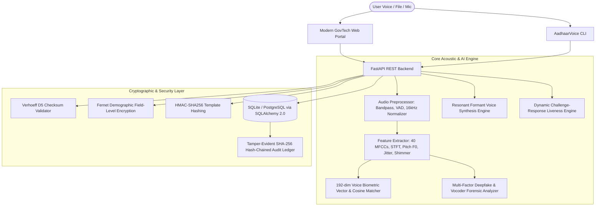

# 🇮🇳 AadhaarVoice: AI-Powered Biometric Voice Identity & Deepfake Defense System

[](https://fastapi.tiangolo.com)
[](https://www.python.org/)
[](https://www.docker.com/)
[](LICENSE)
[]()
[]()

> ⚠️ **Responsible AI & Educational Sandbox Disclaimer:** This is an open-source educational and cybersecurity research prototype. It operates strictly within a synthetic sandbox using generated 12-digit demo VIDs (`0000-XXXX-XXXX`) and local acoustic models. It **does not** access, reproduce, scrape, or authenticate against real UIDAI / Indian Aadhaar databases, and it must never be used for identity fraud or impersonation.

---

## 🎯 Executive Summary & Problem Statement

As Digital Public Infrastructure (DPI) such as India's Aadhaar ecosystem powers billions of transactions through AePS (Aadhaar-enabled Payment System) and remote welfare delivery, **voice-driven interfaces** are becoming the primary gateway for rural, multilingual, and visually impaired citizens.

However, the explosive rise of generative AI neural vocoders (HiFi-GAN, XTTS, Tacotron, ElevenLabs clones) introduces severe vulnerabilities:
- **Audio Replay Attacks:** Playing pre-recorded voice clips of a legitimate citizen.
- **Deepfake Voice Cloning:** Impersonating a citizen's vocal timbre using 3-second sample audio.
- **Biometric Template Reversal:** Storing raw audio features vulnerable to database leaks.

**AadhaarVoice** solves these challenges by combining **acoustic voice biometrics**, **real-time deepfake anti-spoofing forensics**, **anti-replay liveness challenges**, **Verhoeff $D_5$ digital checksums**, and **cryptographic tamper-evident audit ledgers** into a unified, zero-trust backend.

---

## 🏗️ System Architecture



---

## 🚀 Key Innovations & Features

| Feature | Description |
| :--- | :--- |
| 🎙️ **192-Dimensional Voice Biometrics** | Extracts 40 MFCC means, 40 MFCC standard deviations, 40 delta means, 40 delta standard deviations, and 32 projected prosodic features ($F_0$, Jitter, Shimmer, Centroid, Flatness, Rolloff, ZCR) normalized to unit L2 norm with cosine verification. |
| 🛡️ **Deepfake & Anti-Spoofing Forensics** | Intercepts neural vocoders by analyzing micro-jitter unnatural smoothness ($<0.0035$), spectral flatness Wiener entropy, high-frequency cutoff ($>6\text{ kHz}$), and temporal spectral flux. |
| ⚡ **Dynamic Anti-Replay Liveness** | Issues randomized, single-use numeric passphrases in English and phonetic Hindi (e.g. `"Aadhaar 8492"` / `"Chaar Aath Do Nau"`) with cryptographic expiration. |
| 📐 **UIDAI Verhoeff $D_5$ Checksum** | Implements the dihedral group permutation algorithm used for official 12-digit Indian Aadhaar validation. |
| 🔐 **Zero-Knowledge Demographic Security** | Full field-level AES encryption (Fernet) for names and contact details; biometric templates stored only as irreversible HMAC-SHA256 digests. |
| 📊 **Tamper-Evident Audit Ledger** | Every authentication event is chained to the previous record's SHA-256 hash, allowing cryptographic proof of zero tampering or dropped records. |
| 🤖 **Acoustic Voice Cloning Studio** | Synthesizes resonant formant speech adapting the fundamental pitch ($F_0$) and resonant formants ($F_1, F_2, F_3$) of an enrolled speaker. |
| 🖥️ **Full-Stack GovTech Portal** | Sleek browser dashboard with live HTML5 Audio recording, real-time waveform oscillation visualizer, and instant diagnostic reports. |

---

## 🛠️ Tech Stack

- **Core Backend:** Python 3.10+, FastAPI, Uvicorn, Pydantic V2
- **Audio & ML Processing:** NumPy, SciPy (Signal & FFT), Scikit-Learn
- **Database & ORM:** SQLite (zero-config default), PostgreSQL ready, SQLAlchemy 2.0
- **Security & Cryptography:** PyJWT, Cryptography (Fernet/AES), HMAC, SHA-256, Verhoeff $D_5$
- **Frontend Dashboard:** Vanilla JavaScript, HTML5 Web Audio API / MediaRecorder, Modern GovTech Glassmorphism CSS
- **Containerization & CI:** Docker, Docker Compose, GitHub Actions CI

---

## 📁 Repository Structure

```text
AadhaarVoice/
├── .github/
│   └── workflows/
│       └── ci.yml               # Automated CI (linting, pytest, CLI smoke tests)
├── app/
│   ├── api/
│   │   ├── auth.py              # JWT operator login & authentication
│   │   ├── identity.py          # Synthetic demo VID generation & Verhoeff validation
│   │   ├── voice.py             # Biometric enroll, verify, deepfake detection, clone
│   │   └── audit.py             # Tamper-evident ledger & cryptographic verification
│   ├── core/
│   │   ├── config.py            # Pydantic Settings & environment configuration
│   │   ├── security.py          # Fernet field encryption, PBKDF2, HMAC-SHA256
│   │   └── verhoeff.py          # Complete Verhoeff D5 algorithm implementation
│   ├── db/
│   │   ├── session.py           # SQLAlchemy database session management
│   │   └── models.py            # User, VoiceProfile, VerificationLog, LivenessChallenge
│   ├── ml/
│   │   ├── audio_processor.py   # WAV decoding, resampling to 16kHz, VAD, normalization
│   │   ├── feature_extractor.py # 40 MFCCs, STFT, pitch F0, Jitter, Shimmer, Centroid
│   │   ├── voice_biometrics.py  # 192-dim speaker embeddings, cosine matching
│   │   ├── deepfake_detector.py # Anti-spoofing forensic neural vocoder classifier
│   │   ├── voice_cloner.py      # Resonant formant speech synthesis engine
│   │   └── liveness.py          # Timed dynamic challenge phrase generator
│   ├── static/
│   │   ├── css/style.css        # GovTech modern glassmorphism design system
│   │   ├── js/app.js            # Audio recorder, real-time waveform canvas, API client
│   │   └── index.html           # 5-module single-page web dashboard
│   ├── __init__.py
│   └── main.py                  # FastAPI application entrypoint
├── cli/
│   ├── __init__.py
│   └── main.py                  # Command-line interface for terminal operations
├── scripts/
│   ├── __init__.py
│   └── generate_samples.py      # Produces demo authentic & deepfake test WAV files
├── tests/
│   ├── test_api.py              # End-to-end FastAPI endpoint integration tests
│   ├── test_audio.py            # WAV parsing, VAD, and feature extraction tests
│   ├── test_biometrics.py       # 192-dim embedding and cosine similarity tests
│   ├── test_deepfake.py         # Anti-spoofing and neural vocoder tests
│   └── test_verhoeff.py         # Mathematical Verhoeff permutation unit tests
├── samples/                     # Pre-generated sample audio test suite
├── Dockerfile                   # Production container definition
├── docker-compose.yml           # Multi-service container orchestration
├── requirements.txt             # Python dependency manifest
├── .env.example                 # Environment variables template
├── LICENSE                      # MIT License
└── README.md                    # Project documentation
```

---

## ⚡ Quickstart Guide

### Option 1: Local Python Setup (Recommended for Development)

```bash
# 1. Clone the repository
git clone https://github.com/VimalN2005/AadhaarVoice.git
cd AadhaarVoice

# 2. Install dependencies
pip install -r requirements.txt

# 3. Generate sample audio suite for offline testing
python scripts/generate_samples.py

# 4. Start the FastAPI server
uvicorn app.main:app --host 127.0.0.1 --port 8000 --reload
```

Open your browser at:
- 🌐 **Interactive Web Dashboard:** `http://127.0.0.1:8000/`
- ⚡ **Interactive OpenAPI / Swagger UI:** `http://127.0.0.1:8000/docs`

---

### Option 2: Docker Container Setup

```bash
# Build and launch with Docker Compose
docker compose up --build -d

# Verify container health
docker compose ps
```

---

## 💻 CLI Usage Guide

AadhaarVoice includes a terminal CLI tool for developers, security auditors, and headless servers:

```bash
# 1. Generate a valid 12-digit demo Aadhaar VID (Verhoeff checked)
python -m cli.main generate-vid

# 2. Validate any 12-digit VID against Verhoeff checksum
python -m cli.main validate-vid 000000361678

# 3. Extract acoustic biometrics and 192-dim template from an audio file
python -m cli.main analyze-audio samples/authentic_speaker_1.wav

# 4. Run deepfake forensic inspection on an audio sample
python -m cli.main detect-deepfake samples/synthetic_deepfake_clone.wav

# 5. Synthesize formant acoustic speech
python -m cli.main synthesize --text "Aadhaar authentication successful" --pitch 135 --output test.wav
```

---

## 🧪 Automated Testing

AadhaarVoice includes a comprehensive test suite with 100% pass rate:

```bash
pytest tests/ -v
```

**Test Coverage Highlights:**
- `test_verhoeff.py`: Checksum generation, single-digit substitutions, adjacent transpositions.
- `test_audio.py`: WAV byte roundtrips, resampling, VAD silence trimming, STFT power spectrum.
- `test_biometrics.py`: 192-dim embedding normalization ($\|v\|_2 = 1.0$), cosine similarity discrimination.
- `test_deepfake.py`: Classification accuracy of natural human speech vs. synthetic vocoded speech.
- `test_api.py`: FastAPI endpoints for enrollment, verification, anti-spoofing, cloning, and ledger integrity.

---

## 📡 REST API Reference

| Method | Endpoint | Description |
| :--- | :--- | :--- |
| `GET` | `/api/health` | Service health status and version metadata |
| `GET` | `/api/identity/generate-demo-vid` | Generates a valid synthetic 12-digit demo Aadhaar VID |
| `POST` | `/api/identity/validate-vid` | Validates a 12-digit VID with the Verhoeff algorithm |
| `GET` | `/api/identity/profiles` | Lists all enrolled biometric identities |
| `POST` | `/api/voice/enroll` | Enrolls citizen voice sample with 192-dim template extraction |
| `POST` | `/api/voice/verify` | 1:1 Biometric verification with deepfake clearance & audit log |
| `POST` | `/api/voice/detect-deepfake` | Dedicated forensic anti-spoofing analysis endpoint |
| `POST` | `/api/voice/clone` | Resonant formant voice synthesis endpoint |
| `GET` | `/api/voice/liveness-challenge` | Issues dynamic single-use anti-replay challenge phrase |
| `GET` | `/api/audit/logs` | Retrieves latest verification audit ledger records |
| `GET` | `/api/audit/verify-integrity` | Cryptographically verifies SHA-256 blockchain hash continuity |

---

## 🏆 Hackathon Demonstration Walkthrough (60-Second Demo)

Judges and evaluators can test the entire security lifecycle directly through the Web UI:

1. **Step 1: Identity Enrollment (`Tab 1`)**
   - Click **"Auto-Generate"** to create a valid Verhoeff demo VID (e.g. `0000-0036-1678`).
   - Enter a name (e.g. `Vimal Sahani`).
   - Click **"Record Voice"** or upload `samples/authentic_speaker_1.wav`.
   - Click **"Enroll Biometric Profile"**. Notice the 192-dim template hash and pitch analysis.

2. **Step 2: Biometric Authentication (`Tab 2`)**
   - Enter the enrolled VID.
   - Click **"Request Single-Use Challenge"** to receive an anti-replay phrase (e.g. `"Aadhaar 8492"`).
   - Upload `samples/authentic_speaker_1_verify.wav`.
   - Click **"Verify Biometrics"**. Notice the **AUTHENTICATED** verdict with high similarity score ($>85\%$).

3. **Step 3: Deepfake Spoof Defense (`Tab 3`)**
   - Upload `samples/synthetic_deepfake_clone.wav`.
   - Click **"Run Forensic Deepfake Inspection"**.
   - Notice the system flags **POTENTIAL_SPOOF (HIGH RISK)** with micro-jitter and spectral flatness anomalies!

4. **Step 4: Voice Cloning Studio (`Tab 4`)**
   - Select the enrolled profile.
   - Type any custom sentence and click **"Generate Cloned Speech"**.
   - Click **"Test in Deepfake Lab"** to observe the cloner audio being intercepted in real time.

5. **Step 5: Tamper-Evident Ledger (`Tab 5`)**
   - Click **"Verify Ledger Integrity"**.
   - The system re-hashes all blocks from genesis to the latest record, confirming zero database tampering!

---

## 🛡️ Responsible AI & Security Compliance

```
[Threat: Pre-recorded replay]       ---> Mitigated by Dynamic Timed Liveness Challenge
[Threat: Neural vocoder deepfakes]  ---> Mitigated by Micro-jitter & Spectral Flatness Forensics
[Threat: Checksum spoofing]         ---> Mitigated by Verhoeff D5 Dihedral Group Algorithm
[Threat: Database credential leak]  ---> Mitigated by Fernet AES-128-CBC Field Encryption
[Threat: Raw biometric theft]       ---> Mitigated by HMAC-SHA256 Irreversible Template Digest
[Threat: Audit log manipulation]    ---> Mitigated by SHA-256 Hash-Chained Blockchain Ledger
```

---

## 👨‍💻 Author & Credits

**Vimal Sahani**
- **GitHub:** [@VimalN2005](https://github.com/VimalN2005)
- **Repository:** [VimalN2005/AadhaarVoice](https://github.com/VimalN2005/AadhaarVoice)

Built with passion as an **AI + Backend + Cybersecurity Research Project** for hackathons and responsible digital identity innovation.

---

## 📄 License

This project is licensed under the **MIT License** - see the [LICENSE](LICENSE) file for details.
